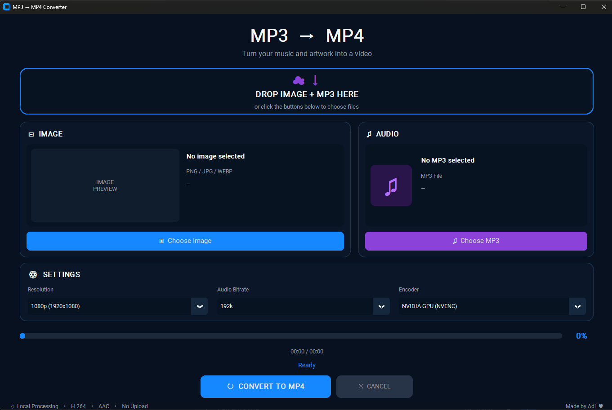

# 🎵 MP3 → MP4 Converter

A simple, fast and completely offline Windows application that turns an image and an MP3 audio file into an MP4 video.



##  Features

| Feature | Details |
|---|---|
|  Image input | PNG, JPG, JPEG, WEBP and BMP |
|  Audio input | MP3 |
|  Drag & drop | Drop your image and MP3 directly into the app |
|  NVIDIA NVENC | Hardware-accelerated H.264 encoding |
|  CPU encoding | H.264 software encoding |
|  Resolutions | 720p, 1080p, 1440p and 4K |
|  Audio bitrate | 128k, 192k, 256k and 320k |
|  Progress | Real-time conversion progress |
|  Cancellation | Stop an active conversion |
|  Preferences | Remembers your settings and output folder |
|  Interface | Dark-themed graphical interface |
|  Privacy | Files are processed locally |
|  Internet | Not required to use the application |

## 📥 Download

### Windows

**[⬇️ Download MP3 → MP4 Converter v1.0.0](../../releases/latest)**

Download the `.exe` from the latest GitHub Release.

No Python installation is required.

## 🚀 How to Use

1. Open **MP3 → MP4 Converter**.
2. Choose an image and an MP3 file.
3. Alternatively, drag both files into the drop area.
4. Select your desired resolution.
5. Select your audio bitrate.
6. Choose your encoder:
   - **NVIDIA GPU (NVENC)** for supported NVIDIA GPUs
   - **CPU (H.264)** for software encoding
7. Click **Convert to MP4**.
8. Choose where to save the resulting MP4.

## ⚡ NVIDIA NVENC

If your NVIDIA GPU supports NVENC, the application can use hardware-accelerated H.264 encoding.

This can provide substantially faster encoding than CPU-based H.264 encoding, depending on your hardware and settings.

If NVENC is unavailable on your system, use **CPU (H.264)** instead.

## 🔒 Privacy & Offline Processing

The application processes your files locally on your computer.

Your image and MP3 are **not uploaded to a server**.

An internet connection is not required to perform conversions.

## 🛠️ Built With

- [Python](https://www.python.org/)
- [CustomTkinter](https://github.com/TomSchimansky/CustomTkinter)
- [TkinterDnD](https://github.com/pmgagne/tkinterdnd2)
- [FFmpeg](https://ffmpeg.org/)
- [PyInstaller](https://pyinstaller.org/)

## 👨‍💻 Development

Clone the repository:

```bash
git clone https://github.com/ThatAditya/mp3-to-mp4-converter.git
cd mp3-to-mp4-converter